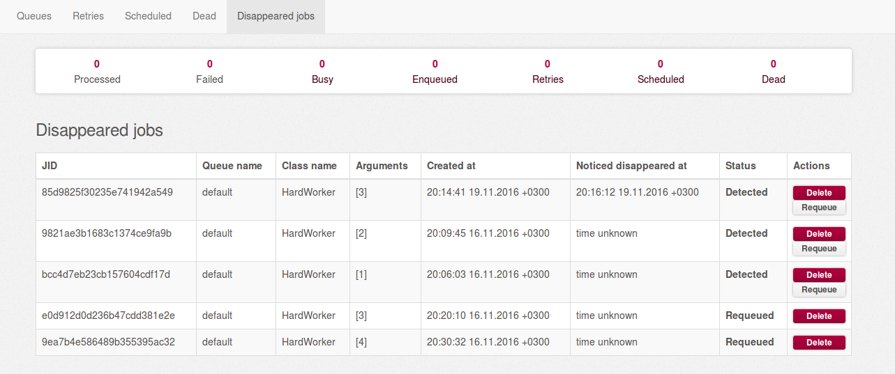

# Attentive Sidekiq

[](https://badge.fury.io/rb/attentive_sidekiq)
[](https://codeclimate.com/github/twonegatives/attentive_sidekiq)
[](https://circleci.com/gh/twonegatives/attentive_sidekiq)


### Motivation
Bad things happen sometimes. Sidekiq process being killed in the middle of job processing may lead to job losage. In other words, that job will never be returned to the queue.
This case was proved by [github issues](https://github.com/mperham/sidekiq/issues/1831), [stackoverflow questions](http://stackoverflow.com/questions/35555000/current-sidekiq-job-lost-when-deploying-to-heroku) and (sadly) personal experience, and means that you are not safe from losing critical user data.
Sidekiq's author, Mike Perham, suggests purchasing Sidekiq Pro which uses another fetch mechanism. However, it [is reported](https://github.com/mperham/sidekiq/issues/2531) to still cause the same issue.

### About
Attentive Sidekiq is a sidekiq plugin which makes one more step to guard your jobs from being lost (well, at least to be notified of this).
It saves info about started jobs into additional redis hash and keeps them there till jobs are finished.
In case there appears a job being started but not finished and not being processing at the moment, you will know something bad happened.

### Usage
Attentive Sidekiq provides you with a couple of useful API methods.

To get a hash containing all information about jobs marked as lost:
```ruby
AttentiveSidekiq::Disappeared.jobs
```

To get only JIDs of lost jobs:
```ruby
AttentiveSidekiq::Disappeared.job_ids
```

To place a disappeared job back into queue:
```ruby
AttentiveSidekiq::Disappeared.requeue(jid)
```

To remove a job from disappeared hash (e.g. after manual requeue):
```ruby
AttentiveSidekiq::Disappeared.remove(jid)
```

### Sidekiq Web integration
You may also watch info about disappeared jobs in a web UI.
Simply make sure you have Sidekiq UI enabled, then head right to the Disappeared Jobs tab in the navbar.
The Web UI uses the API exclusively: anything you can do in the UI can be scripted with the API.



### Pre-requirements and notes

- Attentive Sidekiq assumes you've got Sidekiq installed already.
- You should make sure sidekiq process is started in order for disappeared jobs updater to work properly.
- It was tested with Sidekiq version 4. Seamless functionality with lower sidekiq versions is not guaranteed.

### Installation

Add this line to your application's Gemfile:
    
    gem 'attentive_sidekiq'

And then execute:

    $ bundle

Configure your middleware chains, lookup [Middleware usage](https://github.com/mperham/sidekiq/wiki/Middleware) on Sidekiq wiki for more info.

```ruby
Sidekiq.configure_server do |config|
  config.server_middleware do |chain|
    chain.add AttentiveSidekiq::Middleware::Server::Attentionist
  end
end
```

After that you can use your jobs as usual.

### Suggestions? Bugs?

If you've got a question, feature suggestion or found a bug please add an [issue on GitHub](https://github.com/twonegatives/attentive_sidekiq/issues) or fork the project and send a pull request.
